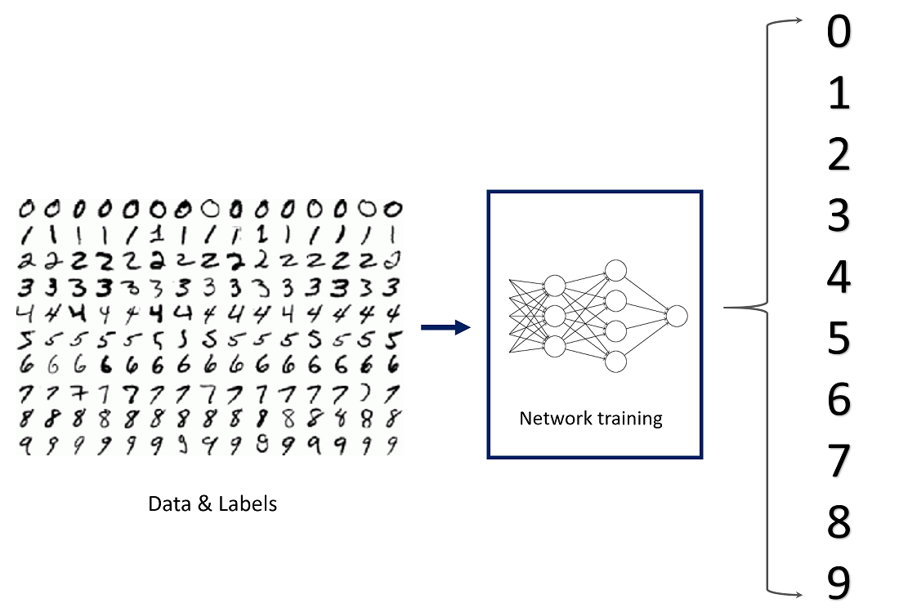

# CSC1004-python-project

## Task description
The project is about using Convolutional Neural Networks (CNN) to classify handwritten digits.

To achieve it, the code will do the following:
- Load the training config.
- Download the minist dataset (divided into training and testing sets).
- Construct the neural network.
- Update the network parameters with training dataset by minimizing the loss. (Training).
- Test the neural network with the testing dataset. (Testing)
- Plot the results.

## How the Deep Learning is implemented

The given code is in main_given.py

My implementation is in main.py

See original repository: [here](https://github.com/Guiliang/CSC1004-python-project)

My repository: [here](https://github.com/Hyle33ies/CSC1004-Python-ImageClassification)

##### main function

1. Load the config and random seeds.
2. Run the multiprocessing with different seeds.
3. Plot the results. They are recorded by the .txt file.

##### run_with_seed and run

1. Modify the config to the seed assigned, then run with the updated config.
2. In the run function, first assign the seed and device (CPU or CUDA).
3. The rest of the run part was given. It mainly does the following:
   1. Set DataLoader arguments based on whether CUDA is available
   2. Load and preprocess the MNIST dataset
   3. Initialize the DataLoaders for training and testing, model, optimizer, and learning rate scheduler
   4. Train and test the model for each epoch as well as update the leraning rate scheduler. At the same time records the statistics.
   5. Plot the training and testing performance
   6. Save the results to a file and save the trained model

##### train function

1. Iterate through each batch in the training dataset loader.
2. Move the input data and target labels to the device.
3. Reset the gradients to zero for the optimizer.
4. Forward pass: compute the model's output based on the input data.
5. Compute the loss between the model's output and target labels.
6. Backward pass: compute gradients of the loss with respect to the model's parameters.
7. Update the model's parameters using the gradients.
8. Accumulate the total loss for current batch.
9. Get the index of the max log-probability (i.e., the predicted class) for each sample in the batch.
10. Compare the predicted class with the target class and count the number of correct predictions.
11. After the for loop: Compute the average loss and accuracy for this training set.

##### test function

1. Iterate through each batch in the test dataset loader.
2. Move the input data and target labels to the device.
3. Forward pass: compute the model's output based on the input.
4. Compute the loss, take the summation.
5. Get the index of the max log-probability (i.e., the predicted class) for each sample in the batch.
6. Count the number of correct predictions .

##### plot function & plot_mean

Simply use the pyplot API to plot the epoch and performance data along with the title and label as required.

The plot_mean function reads the data recorded in text files, use a list to store the epoch and use the dictionary for each epoch to store the four datas used for plotting. Then convert each group of data who belong to the same plot into a list as the "performance" parameter of the plot function.
